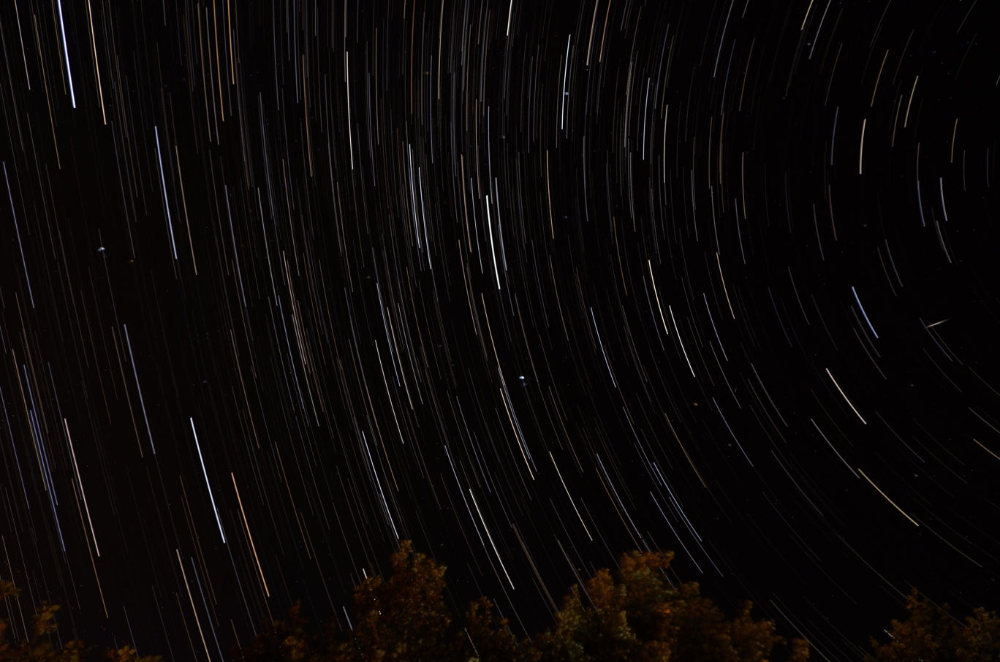
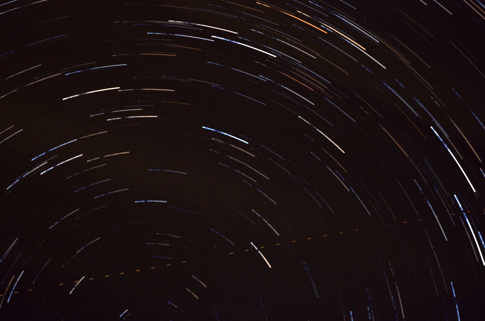

# AstroScripts
This project contains some python scripts that can be used for astro photography

## Generate a star trail image

Example of Star trails produced with star_trails.py
It can be used to stack many images of the same area of the sky to produce a beautiful star trail image.

Usage:

python .\star_trails.py --images_folder_path path/to/folder

## Generate a star trail video

The script star_video_generator.py can be used to produce a nice video of "moving stars" (due to Earth's movement)
by stacking multiple images into a video.

Example usage:
python .\star_video_generator.py --images_folder_path Photos
